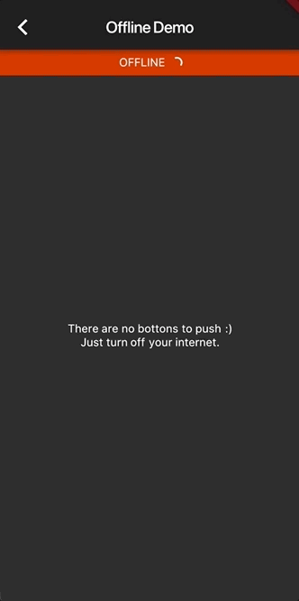

# ✈️ Flutter Offline

[](https://pub.dartlang.org/packages/flutter_offline)

Handle offline/online connectivity in Flutter like a Boss. Ample support for both iOS and Android platforms.

## 🎖 Installing

```yaml
dependencies:
  flutter_offline: "^0.1.0"
```

### ⚡️ Import

```dart
import 'package:flutter_offline/flutter_offline.dart';
```

## 🎮 How To Use

```dart
import 'package:flutter/material.dart';
import 'package:flutter_offline/flutter_offline.dart';

class OfflineDelegate extends OfflineBuilderDelegate {
  @override
  Widget builder(BuildContext context, bool state) {
    return new Stack(
      fit: StackFit.expand,
      children: [
        Positioned(
          height: 24.0,
          left: 0.0,
          right: 0.0,
          child: Container(
            color: state ? Color(0xFF00EE44) : Color(0xFFEE4400),
            child: Center(
              child: Text("${state ? 'ONLINE' : 'OFFLINE'}"),
            ),
          ),
        ),
        Center(
          child: new Text(
            'Yay!',
          ),
        ),
      ],
    );
  }
}

class DemoPage extends StatelessWidget {
  const DemoPage({
    Key key,
  }) : super(key: key);

  @override
  Widget build(BuildContext context) {
    return new Scaffold(
      appBar: new AppBar(
        title: new Text("Offline Demo"),
      ),
      body: OfflineBuilder(
        delegate: new OfflineDelegate(),
      ),
    );
  }
}
```

For more info, please, refer to the `main.dart` in the example.

## 📷 Screenshots

<table>
  <tr>
    <td align="center">
      
    </td>
    <td align="center">
      
    </td>
    <td align="center">
      
    </td>
  </tr>
</table>

## 🐛 Bugs/Requests

If you encounter any problems feel free to open an issue. If you feel the library is
missing a feature, please raise a ticket on Github and I'll look into it.
Pull request are also welcome.

### ❗️ Note

For help getting started with Flutter, view our online
[documentation](https://flutter.io/).

For help on editing plugin code, view the [documentation](https://flutter.io/platform-plugins/#edit-code).

## ⭐️ License

MIT License
